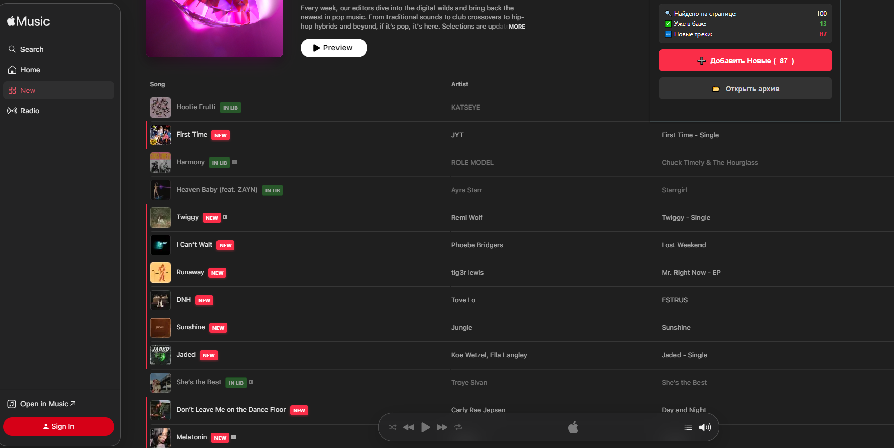

# Apple Music Playlist Tracker

A lightweight browser extension that helps you quickly identify which tracks in Apple Music's editorial playlists (e.g., "New in Pop", "Today's Hits") you have already listened to and which ones are brand new.

When you open a playlist with 50+ songs, it's easy to forget what you've already played. This extension places a clear label next to each track title – **"New"** for unheard tracks and **"Listened"** for those you've already streamed.

## Features

- 🎵 **Visual tags** – "New" and "Listened" labels appear right beside each track.
- 🧠 **Memory aid** – never waste time re-listening to a song you already know.
- 📦 **Zero configuration** – works out of the box with Apple Music's web player.
- 🔄 **Persistent state** – tracks you've played are remembered across sessions (using local storage).

## How it works

The extension stores the IDs of songs you've played in your browser's local storage. When you visit an Apple Music playlist, it compares the current list with the stored IDs and adds the appropriate label.

## Installation

### From source (developer mode)

1. Download or clone this repository.
2. Open Chrome and go to `chrome://extensions/`.
3. Enable **Developer mode** (toggle in the top-right).
4. Click **Load unpacked** and select the folder containing the extension files.
5. The extension is now installed – visit Apple Music and enjoy!

### From Chrome Web Store (recommended)

*(Link will be added once published)*

## Screenshots

## License

MIT – feel free to use and modify.